# Mini_flutter_projects

A number of miscellaneous projects that are not polished/ready enough for the Apple/Google app stores. 

## Quiz App 

This project is a simple quiz game where users have to answer 48 questions to win. Users get four attempts (represented by hearts). Answering a question correctly or incorrectly plays a corresponding audio clip. This project incorporates state management with Riverpod and the audioplayers packages. 

<table>
  <tr>
    <td>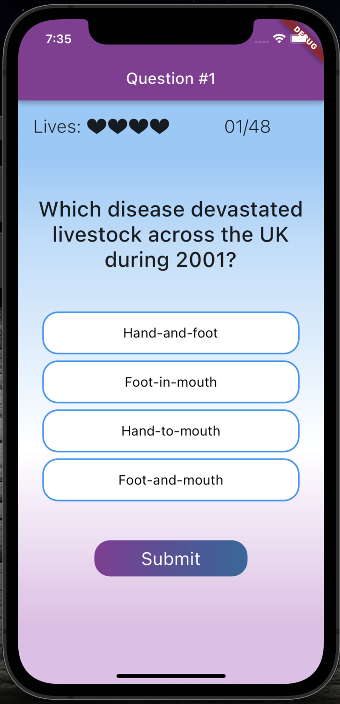</td>
    <td></td>
    <td>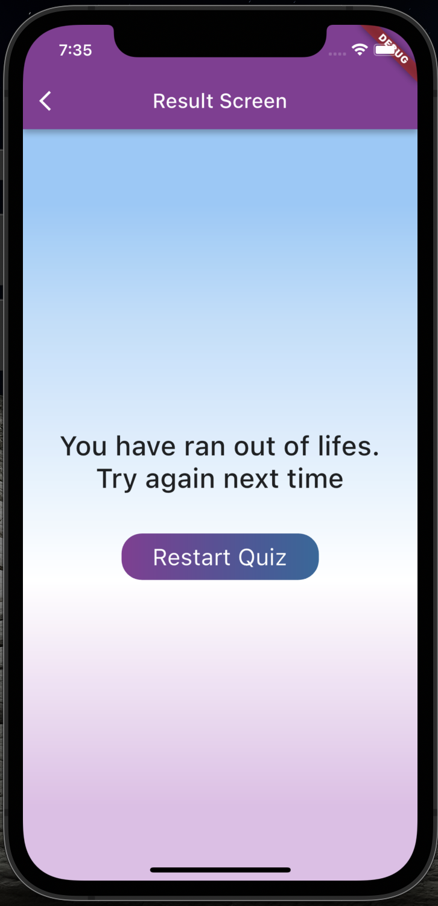</td>
  </tr>
</table>

## Personal Keep 

This project is a simple expense tracker. Users can add items to the track, which will be reflected in the top section chart. This project supports both orientation (landscape & portrait) and platform-appropriate widgets (FloatingActionButton for Android). 

<table>
  <tr>
    <td>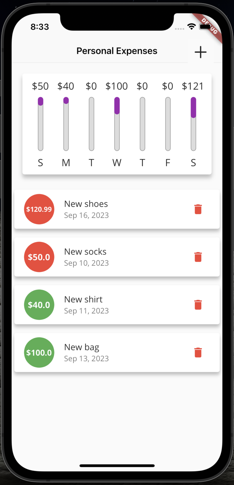</td>
    <td>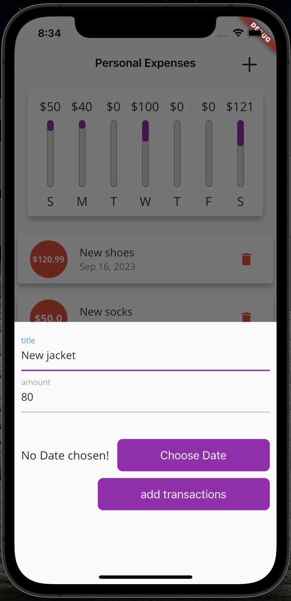</td>
    <td>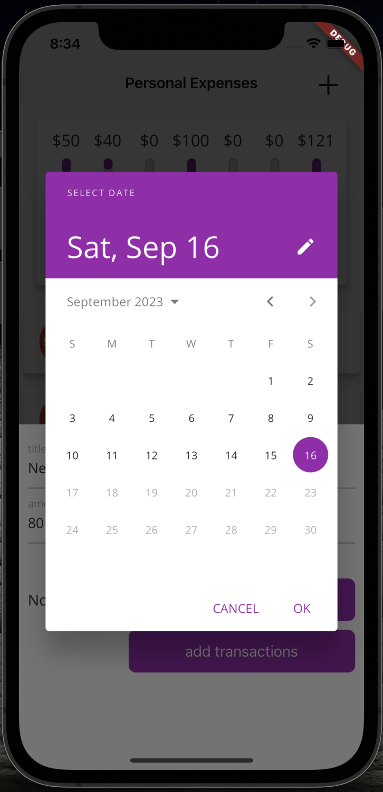</td>
  </tr>
</table>

## Meal Track 

This project is a simple recipe book app. The home screen displays a grid with different recipe categories. Users can navigate through them and choose their favourite recipes for easy access. This project incorporates models, enums and a custom theme.   

<table>
  <tr>
    <td>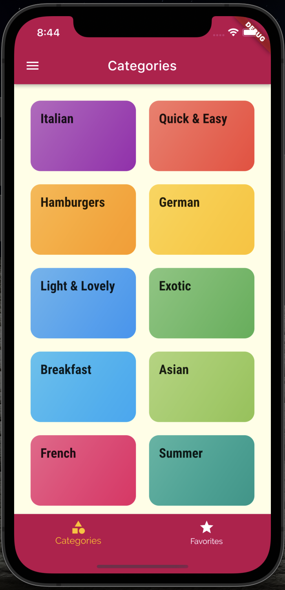</td>
    <td>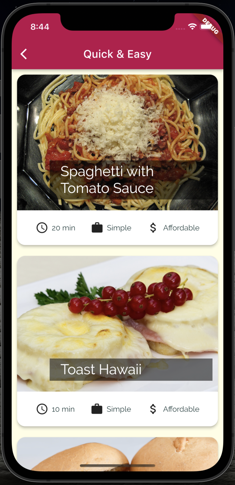</td>
    <td>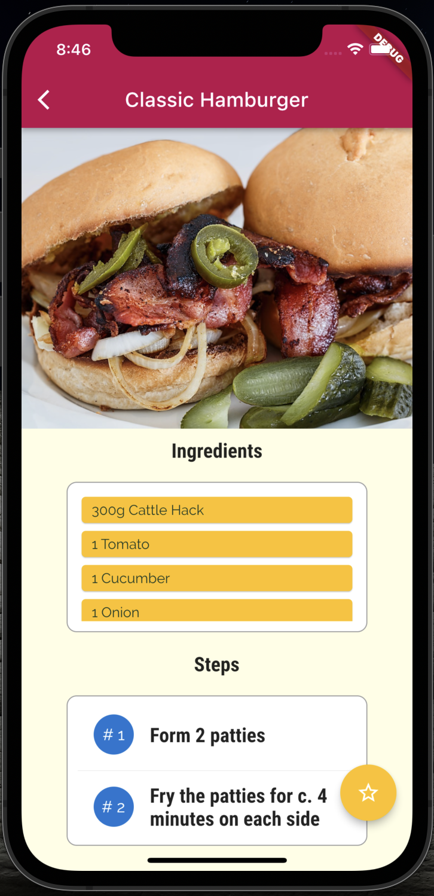</td>
  </tr>
</table>

## Food Boxes (still in development)

This project aims to be a food delivery app with a twist. The project incorporates Firebase authentication, secure API key storage with envied, users' data preservation using Hive and adaptable design.

<table>
  <tr>
    <td>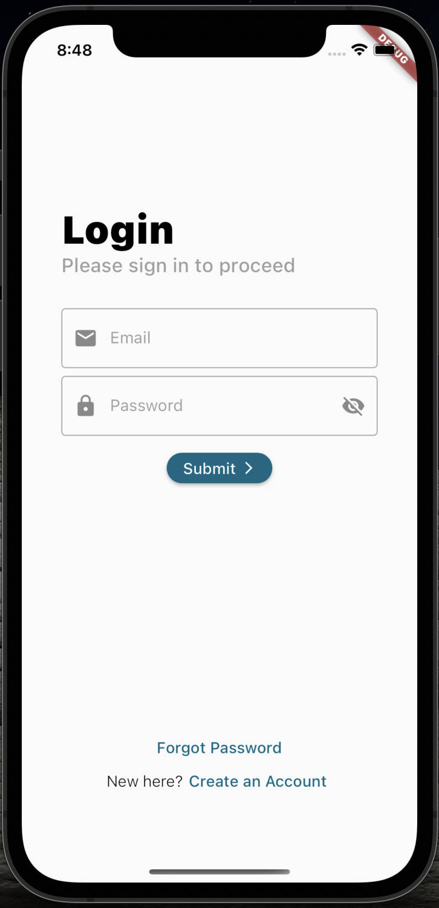</td>
    <td>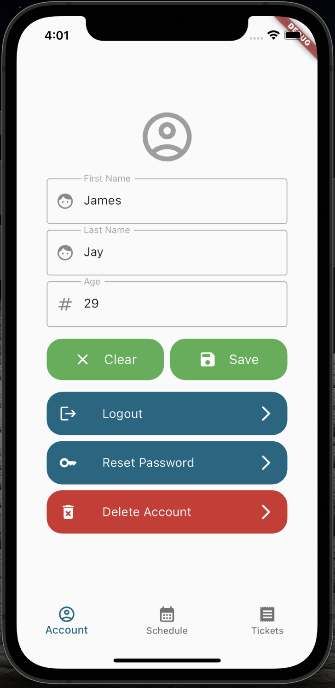</td>
    <td>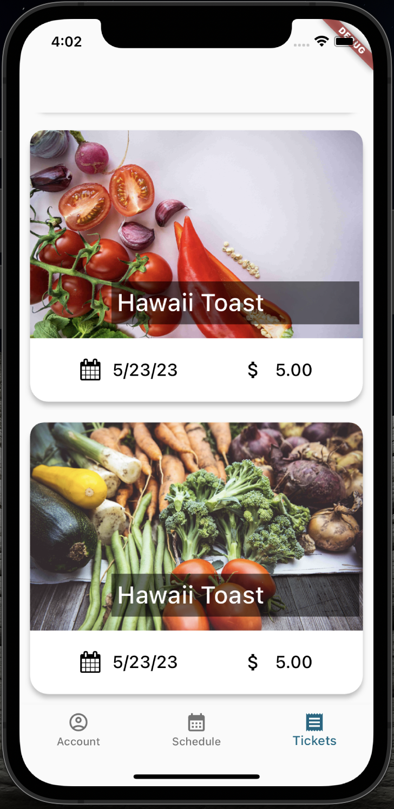</td>
  </tr>
</table>
