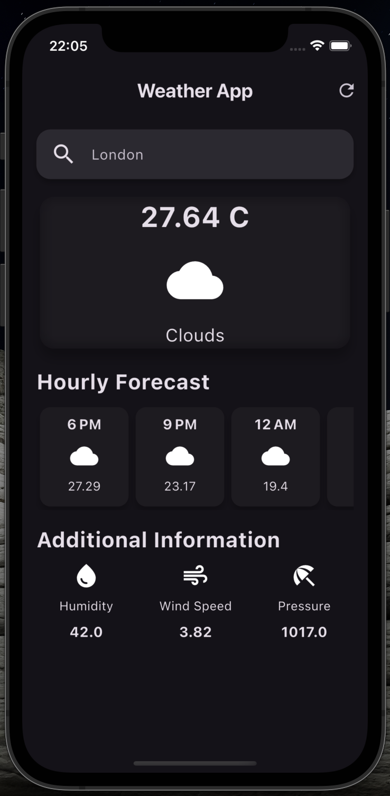

# Mini_flutter_projects

A collection of projects designed for teaching and learning Flutter!!

## Quiz App 

A quiz game with 48 questions to win, where users have four attempts (hearts). Correct or incorrect answers trigger corresponding audio clips. Built using Riverpod for state management and the audioplayers package.

<table>
  <tr>
    <td></td>
    <td></td>
    <td></td>
  </tr>
</table>

## Personal Keep 

An expense tracker app that lets users add purchases, set budgets, and view spending from the past week. Supports both landscape and portrait modes and uses platform-specific widgets like FloatingActionButton on Android.

<table>
  <tr>
    <td></td>
    <td></td>
    <td></td>
  </tr>
</table>

## Meal Track 

A recipe book app where users can browse recipes organized into categories displayed in a clean grid. Users can mark favorite recipes for easy access later. The project utilizes models, enums, and a custom theme.

<table>
  <tr>
    <td></td>
    <td></td>
    <td></td>
  </tr>
</table>

## Chat App 

An app that allows users to create accounts, log in, and send messages to all registered users. It uses Firebase Authentication for login, Storage for profile pictures, Firestore for chat messages and metadata, and Firebase Messaging for notifications.

<table>
  <tr>
    <td></td>
    <td></td>
    <td></td>
  </tr>
</table>

## Weather Map

An app that allows users to query and see weather data for any city. The app uses clean archtiure, bloc event-driven state management, the Open-Weather api, (dot)env files to obscure said api keys and a number of new properties and widget introduce in Flutter version 3.27.

<table>
  <tr>
    <td></td>
    <td></td>
    <td></td>
  </tr>
</table>

## Food Boxes

An app where restaurants and users can upload and view available food boxes for charity giveaways. Users can browse availability via a calendar and place orders. Built with Firebase Authentication, Cloud Firestore, Riverpod, and a responsive design.

<table>
  <tr>
    <td></td>
    <td></td>
    <td></td>
  </tr>
</table>

